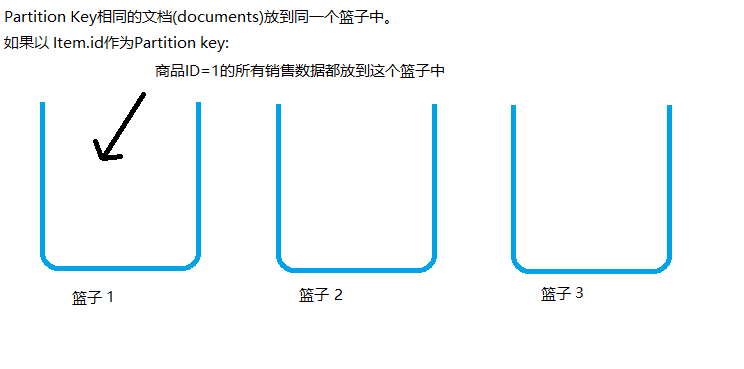
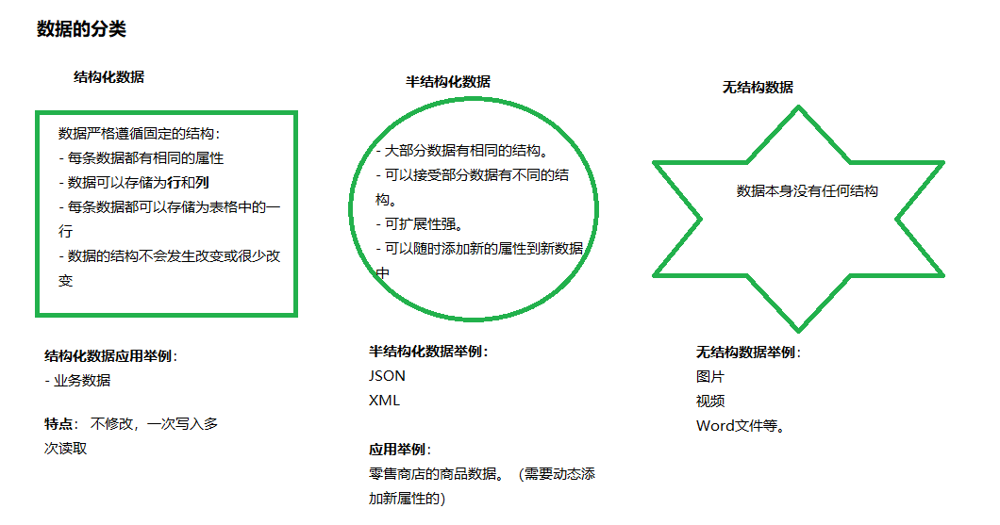

## Gremlin API - graph query language
图论API，针对图论数据库的查询语言。 

图论数据库是用来存储产品之间的相关联程度。比如，产品A和产品B之间是有关系的，他们关系的强弱可以使用一个权重值表示，每次购买产品A的同时也购买了产品B,则他们的权重加1. 使用实例，用来在购物网站做智能推荐。

## Partition key的概念

Partition是数据存储的分类依据，Partition Key相同的文档(documents)存放在同一块区域，使用partition Key来检索数据会获得**很高的性能**和**很少的代价**。

以零售订单为例，在Partition Key的选取时：
- 可以选取商品的ID作为Partition Key, 那么同一个商品的所有销售数据都存放于同一个Partition， 以商品的ID作为查询条件，则性能高，代价小。
- 可以选取顾客的ID作为Partition Key, 那么同一个顾客所购买的历史纪录数据都存放在同一个Partition, 以顾客的ID作为查询条件，则性能高，代价小。

如果把数据存储看做时把鸡蛋放到篮子中，那么：
- 拥有相同Partition Key的所有文档(documents) 会被存放在同一个篮子里。
- 如果查询条件时Partition key, 那么就如同在同一个篮子中找文件，这样查找起来会高效。
- 如果查询条件不是Partition Key, 那么就如同在不同的篮子之间来回查找，则效率低下。

## 数据的分类

不同数据依据用途可以用不同的数据库存储， 数据可以分为：
- 结构化
- 本结构化
- 无结构

